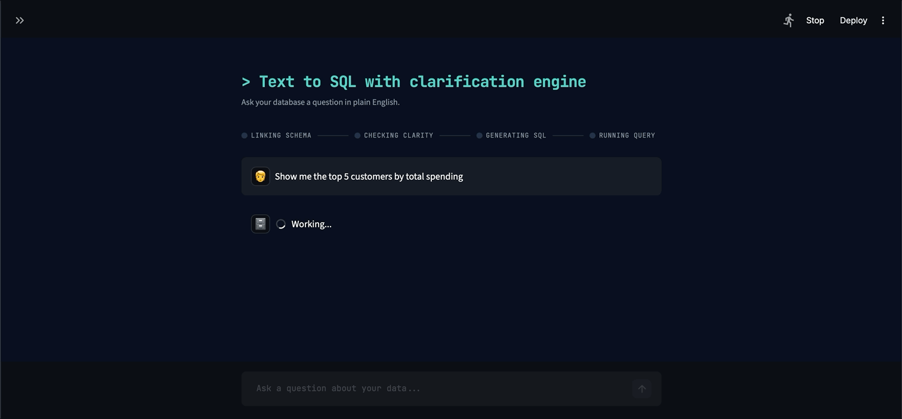
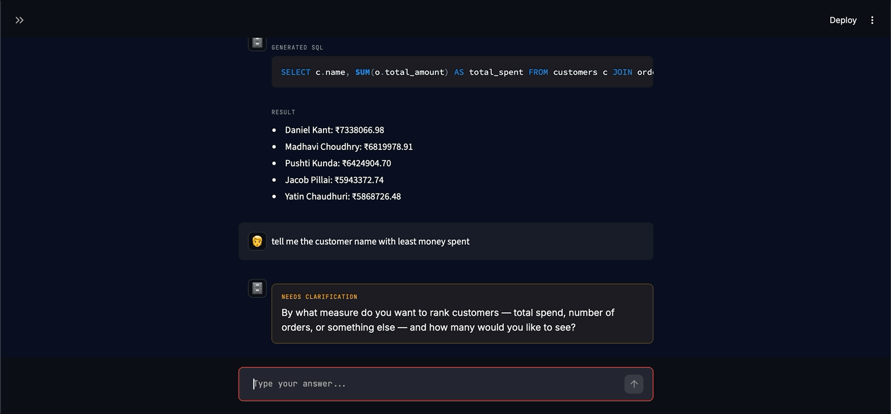

# Ledger — Text-to-SQL with a Clarification Engine

Ask a database a question in plain English. If the question is ambiguous,
the system asks one clarifying question back before writing any SQL —
instead of silently guessing and returning the wrong answer.

Built with LangGraph, Google Gemini, PostgreSQL (hosted on Supabase), and
a Streamlit frontend.

## Demo

**Live Demo:** https://text-to-sql-with-classification-by-rudra.streamlit.app

**Repository:** https://github.com/Ruddrayadav/Text-to-Sql-with-classification-ai

<!-- Add a screenshot or GIF of the application here -->



---


---

## Why this exists

Most text-to-SQL demos assume the user's question is already precise
enough to translate directly into SQL. In practice it usually isn't —
"show me top customers" doesn't say *by what metric* or *how many*, and
a naive system just picks an interpretation and returns an answer that
looks confident but may not be what the user meant.

This project treats ambiguity as a first-class problem: before generating
SQL, the pipeline explicitly checks whether the request is answerable
as-is, and if not, asks the user a single targeted question rather than
guessing.

---

## What I built

Ledger is not a single prompt that sends a user question to an LLM and
expects SQL back. It is a stateful LangGraph workflow where different
stages are responsible for different decisions.

The main components I implemented are:

* Database scope classification
* Schema retrieval and schema-aware SQL generation
* Ambiguity detection
* Human-in-the-loop clarification
* SQL generation
* SQL validation
* PostgreSQL execution
* Database-error-driven SQL retries
* Result formatting
* Read-only database access
* Streamlit frontend

The system is designed so that an unrelated request can be stopped before
it reaches SQL generation or database execution.

---

## Architecture

The pipeline is a LangGraph state machine with five stages and two loops:

```text
START
  ↓
Scope Guard        — is this even a database question?
  ↓ (no)  → Rejected → END
  ↓ (yes)
Schema Linker       — attach the DB schema to the request
  ↓
Ambiguity Agent     — can this be answered unambiguously?
  ↓ (ambiguous)          ↓ (clear)
Clarification ──────┐    SQL Agent
  (loops back to         ↓
   Ambiguity Agent)      Execute Agent
                          ↓ (DB error, retries left)
                          → loops back to SQL Agent with the exact error
                          ↓ (success or out of retries)
                          END
```

**Scope Guard** and **Ambiguity Agent** are deliberately separate nodes,
not one combined check. Early on they were the same prompt, and it caused
a real bug: an off-topic request ("write me a poem") was classified as
"not ambiguous," which routed it straight into SQL generation instead of
being rejected. Scope (*is this a database question at all?*) and
ambiguity (*is this database question missing information?*) are
different questions with different correct actions, so they're now two
nodes with two independent structured outputs.

**Clarification** uses LangGraph's `interrupt()` / `Command(resume=...)`
pattern — the graph genuinely pauses mid-execution (state is persisted by
a checkpointer), the question is shown to the user, and execution resumes
from that exact point once they answer. It loops back through the
Ambiguity Agent rather than assuming one answer always resolves
everything.

**SQL Agent → Execute Agent** has a self-correcting retry loop (capped at
3 attempts): if the generated SQL fails against the real database, the
exact Postgres error is fed back into the SQL Agent's next attempt. Most
Postgres errors name the correct column/table directly, so this often
fixes the query without any human involvement.

---

## Example interactions

### Clear database request

```text
User:
How many customers are from Delhi?

Ledger:
[Generates SQL]

SQL:
SELECT COUNT(*)
FROM customers
WHERE city ILIKE 'Delhi';

Result:
42
```

### Ambiguous request

```text
User:
Show me the best customers.

Ledger:
What should "best" mean — highest total order value,
most orders, or something else?
```

The system does not silently choose an interpretation.

### Unrelated request

```text
User:
What is the capital of India?

Ledger:
I can only help with questions related to the
customers and products database.
```

The request is rejected before it reaches SQL generation.

### SQL execution failure

```text
SQL Agent
    ↓
Generated SQL
    ↓
PostgreSQL
    ↓
Database error
    ↓
Exact error returned to SQL Agent
    ↓
Corrected SQL
    ↓
PostgreSQL
    ↓
Result
```

The retry mechanism is capped at three attempts to prevent an
unbounded generation/execution loop.

---

## Design decisions worth knowing about

**Schema linking doesn't call an LLM.** With 6 tables, passing the raw
schema (table names, columns, types, foreign keys) straight to the SQL
Agent is simpler, free, and just as effective as routing it through an
LLM first. That trade-off flips once a schema is large enough that
including all of it in every prompt becomes expensive or noisy — this
project's schema isn't at that scale, so the simpler approach won.

**Result formatting does call an LLM**, deliberately, even though a
Python formatter is nearly free by comparison — the trade-off here is
call cost vs. output quality, and it was chosen to keep the demo output
polished. On a stricter API quota, a Python-only formatter is the more
reliable choice.

**Two independent layers guard against destructive SQL:** a regex check
rejects any query that isn't `SELECT`/`WITH` before it reaches the
database, and — more importantly — the database connection itself uses a
**read-only Postgres role** with no write/delete/DDL privileges. The
app-level check is a convenience, not the real safety boundary; the
database enforcing it is.

---

## Security and failure handling

Because the SQL is generated by an LLM and eventually reaches a real
database, the application does not rely on prompting alone for database
safety.

The system uses multiple layers:

```text
User Request
     ↓
Scope Guard
     ↓
Schema-aware SQL generation
     ↓
SQL validation
     ↓
Read-only PostgreSQL role
     ↓
Database
```

The database role has no permission to perform INSERT, UPDATE, DELETE,
DROP, ALTER, or other destructive operations.

This means that even if the model generates an unexpected query, the
database permissions provide a second enforcement boundary.

The system is also tested against unrelated requests and prompt-injection
attempts to ensure they are stopped before reaching SQL execution.

---

## Evaluation

The system is being evaluated with a fixed set of deliberately varied
test cases rather than only demonstrating a few successful queries.

The evaluation covers:

* Clean database questions
* Different natural-language formulations
* Multiple-condition queries
* Aggregations and grouping
* Sorting and limiting
* Empty-result queries
* Ambiguous requests
* Non-existent tables
* Non-existent columns
* Unrelated questions
* Prompt-injection attempts
* Destructive SQL attempts
* SQL execution failures
* Retry-loop behavior


---

## Tech stack

* **Orchestration:** LangGraph (state machine, conditional routing,
  human-in-the-loop `interrupt()`)
* **LLM:** Google Gemini (`gemini-2.5-flash-lite`) via `langchain-google-genai`
* **Database:** PostgreSQL, hosted on [Supabase](https://supabase.com) —
  not a local instance, so the app can be deployed and queried from
  anywhere without exposing a personal machine
* **DB access:** SQLAlchemy, connected through a dedicated read-only role
* **Frontend:** Streamlit

---

## Database

Hosted on Supabase. Schema:

* `customers` (id, name, email, city, joined_at, age, state)
* `orders` (id, customer_id → customers.id, order_date, status, total_amount, payment_method)
* `order_items` (id, order_id → orders.id, product_id → products.id, quantity, price)
* `products` (id, name, category, price, brand, stock, rating)
* `payments` (id, order_id → orders.id, payment_method, payment_status, payment_date, amount)
* `reviews` (id, customer_id → customers.id, product_id → products.id, rating, review_text, review_date)

The app connects using a **read-only role**, created separately from the
default Supabase admin credentials:

```sql
CREATE ROLE text_to_sql_readonly WITH LOGIN PASSWORD 'yourpassword';
GRANT CONNECT ON DATABASE postgres TO text_to_sql_readonly;
GRANT USAGE ON SCHEMA public TO text_to_sql_readonly;
GRANT SELECT ON ALL TABLES IN SCHEMA public TO text_to_sql_readonly;
```

Since all SQL running through this app is LLM-generated, this role is the
real safety net — even a bad or hallucinated query can't mutate data,
regardless of what the app-level validation catches or misses.

---

## Project structure

```text
ledger/
├── agent.py
├── prompt.py
├── schemas.py
├── databaseExe.py
├── requirements.txt
└── README.md
```

The exact structure may evolve as the project grows, but the main
responsibilities are separated between the application, graph/prompt
logic, schema handling, database execution, and evaluation.

---

## Running it locally

```bash
git clone <https://github.com/Ruddrayadav/Text-to-Sql-with-classification-ai>
cd <repo>
pip install -r requirements.txt
```

Create a `.env` file:

```env
GOOGLE_API_KEY=your_gemini_api_key
DATABASE_URL=postgresql://text_to_sql_readonly:yourpassword@<supabase-host>:5432/postgres
```

Run it:

```bash
streamlit run app.py
```

For contributors, an `.env.example` file is provided so credentials are
never required to be committed to the repository.

---

## Known limitations

* **Conversation state is in-memory** (`MemorySaver`), not persisted to a
  database. Restarting the app loses any in-progress clarification
  threads. Fine for a demo; would need a persistent checkpointer (e.g.
  Postgres-backed) for production use.
* **Free-tier API quotas can limit public usage.** A single question can
  use 2–4 calls depending on the path taken through the graph (scope
  check, ambiguity check, SQL generation, formatting), so a public
  deployment can exhaust available quota quickly if shared with a real
  audience.
* **Case-insensitive matching for text filters (e.g. city, status names)
  is enforced through prompt instructions, not the database schema** —
  it depends on the model reliably using `ILIKE`/`LOWER()`, which is
  usually but not always followed.
* The current evaluation set is relatively small and manually curated.
  It is useful for regression testing but is not a substitute for a
  large benchmark such as Spider or BIRD.

---
